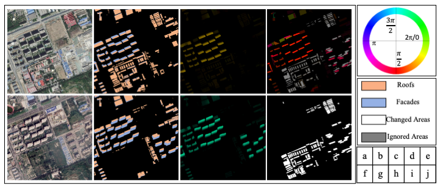

# Detecting-Building-Changes-with-Off-Nadir-Aerial-Images
| [Paper](https://arxiv.org/pdf/2301.10922.pdf) | [Pretrain Weights](https://drive.google.com/file/d/17KMvDbVDa8b7mwH7JTZ0iXwurSJsOqFe/view?usp=drive_link) | [Dataset](https://drive.google.com/drive/folders/1MTwbRLw76f_hThmELkLwKpfRQbkPH28P?usp=sharing)
## Overview
We propose a multi-task guided change detection network model(***MTGCDNet***) model and a building change detection with
off-nadir aerial images dataset (***BANDON***) to address the problem of accurate detection and localization of urban building changes from oblique drone images.


## BANDON
### Demo



The BANDON dataset contains 2283 pairs of images, 2283 change labels, 1891 BT-flows labels,
1891 pairs of segmentation labels, and 1891 pairs of ST-offsets labels ( test sets do not provide auxiliary annotations
), which is superior to many existing building change detection datasets in different aspects

### Download
The BANDON dataset is available: [BaiDu Netdisk](https://pan.baidu.com/s/158yJGXhMJngBIc4pBvHQVA)(pwd:6g4w) || [Google Drive](https://drive.google.com/drive/folders/1MTwbRLw76f_hThmELkLwKpfRQbkPH28P?usp=sharing). 

### Dataset struct
The organization structure for storing the dataset should be as follows:
```
 -BANDON
    |- train
        |- imgs
            |- bj
                |- t1
                    |- xxx.jpg
                    |- ...
                |- t2
                |- t3
            |- sh
        |- labels_unch0ch1ig255
            |- bj
               |- t1VSt2
                    |- xxx.png
                    |- ...
               |- t1VSt3
               |- t2VSt3 
            |- ....
        |- building_labels
        |- offset_st_resize256
        |- flow_bt_resize256
    |- val
    |- test
    |- test_ood
```
### list
The information of the change detection sample pairs in this dataset is saved in the form of text. All the [lists](lists) are located in the lists directory. For example, [list_BANDON_train.txt](./lists/list_BANDON_train.txt) contains the relative file paths of all the samples in the training set. When training/testing, you can modify them to absolute paths.
***It is difficult to obtain the complete change detection sample pairs without using the list files.***

```python
/imgs/bj/t1/L81_00655_784103.jpg /imgs/bj/t2/L81_00655_784103.jpg /labels_unch0ch1ig255/bj/t1VSt2/L81_00655_784103.png /building_labels/bj/t1/L81_00655_784103.png /building_labels/bj/t2/L81_00655_784103.png /offset_st_resize256/bj/t1/L81_00655_784103.tif /offset_st_resize256/bj/t2/L81_00655_784103.tif /flow_btv3_resize256/bj/t1VSt2/L81_00655_784103.tif
/imgs/bj/t2/L81_00871_784063.jpg /imgs/bj/t3/L81_00871_784063.jpg /labels_unch0ch1ig255/bj/t2VSt3/L81_00871_784063.png /building_labels/bj/t2/L81_00871_784063.png /building_labels/bj/t3/L81_00871_784063.png /offset_st_resize256/bj/t2/L81_00871_784063.tif /offset_st_resize256/bj/t3/L81_00871_784063.tif /flow_btv3_resize256/bj/t2VSt3/L81_00871_784063.tif
/imgs/sh/t1/L81_892823_780495.jpg /imgs/sh/t3/L81_892823_780495.jpg /labels_unch0ch1ig255/sh/t1VSt3/L81_892823_780495.png /building_labels/sh/t1/L81_892823_780495.png /building_labels/sh/t3/L81_892823_780495.png /offset_st_resize256/sh/t1/L81_892823_780495.tif /offset_st_resize256/sh/t3/L81_892823_780495.tif /flow_btv3_resize256/sh/t1VSt3/L81_892823_780495.tif
/imgs/sh/t1/L81_892863_780487.jpg /imgs/sh/t2/L81_892863_780487.jpg /labels_unch0ch1ig255/sh/t1VSt2/L81_892863_780487.png /building_labels/sh/t1/L81_892863_780487.png /building_labels/sh/t2/L81_892863_780487.png /offset_st_resize256/sh/t1/L81_892863_780487.tif /offset_st_resize256/sh/t2/L81_892863_780487.tif /flow_btv3_resize256/sh/t1VSt2/L81_892863_780487.tif
```

## MTGCDNet
We also provide the source code for this work, which is built upon [mmsegmentation](https://github.com/open-mmlab/mmsegmentation).
### requirements
This code has been tested successfully in the following environment:
```bash
torch                   1.9.1+cu111
torchvision             0.10.1+cu111
mmcv-full               1.7.0 
```

### Pretrain Weight of ResNet
This project involves the following pre-trained models:
* [resnet-50v1c](https://download.openmmlab.com/pretrain/third_party/resnet50_v1c-2cccc1ad.pth)

[//]: # (* [segformer for changefromer]&#40;https://drive.google.com/file/d/1sSOqghd-1xTxyIJfzP2Tf08jx9a9ezRS/view?usp=sharing&#41; / down and revised the wieghts in [changeformer]&#40;&#41; project.)

### Train 
Step1: Download the pre-trained models and replace the corresponding paths, which involves the file `configs/bandon/models/MTGCDNet.py`.
```
pretrained='/remote-home/pangchao/checkpoints/resnet50_v1c-2cccc1ad.pth'
change to 
pretrained='your resnet50 weight path'
```
Step2: Modify the `data_root` in the configuration file `configs/bandon/traindata` of the training data to your own.
```
data_root='/remote-home/pangchao/data/BANDON/train'
change to      
data_root='your train set path'  
```
Step3: Execute the run command.

```
sh workdirs_bandon/changeformer_bandon/train.sh 2 
# 2 is the number of GPUs
```
### Test and eval
Step 1-2: Refer to the training process.
Step3: Download the pretrain weight of [MTGCDNet](https://drive.google.com/file/d/17KMvDbVDa8b7mwH7JTZ0iXwurSJsOqFe/view?usp=drive_link),and replace it in `workdirs_bandon/MTGCDNet/config_GPU8/iter_40000`
Step4: Execute the run command.

```
bash workdirs_bandon/MTGCDNet/test.sh iter_40000.pth
```
The test results will be saved in `pred_path=workdirs_bandon/MTGCDNet/config_GPU8/iter_40000`.


Step5：Evaluation of the predicted results.

```
python eval_scripts/cal_iou_BANDON.py --pred_path your pred_path in step4 --root_dataset your BANDON path
```

## Citation
If you find our repo useful for your research, please cite us:
```
@article{pang2023detecting,
  title={Detecting building changes with off-nadir aerial images},
  author={Pang, Chao and Wu, Jiang and Ding, Jian and Song, Can and Xia, Gui-Song},
  journal={Science China Information Sciences},
  volume={66},
  number={4},
  pages={1--15},
  year={2023},
  publisher={Springer}
}
```


